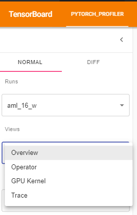
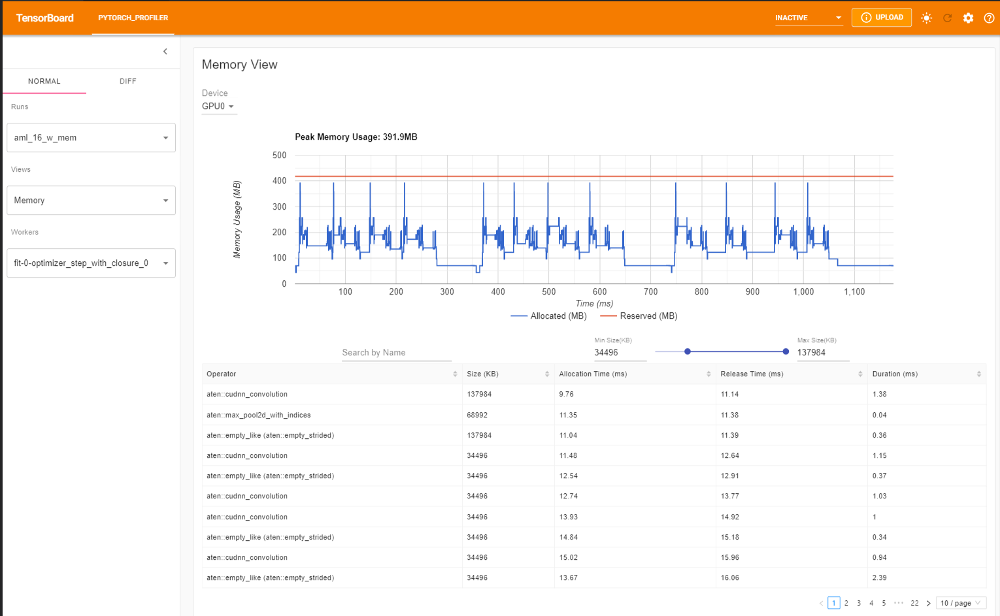

# Debugging and Profiling

While using the hi-ml toolbox modules, you might encounter some errors that require running the code step by step in
order to track down the source of these errors. Here are some guidelines to help you debug and/or profile hi-ml deep
learning training pipelines.

## Debugging within VS Code

VS code has a great [Debugging Support](https://code.visualstudio.com/docs/editor/debugging) for many programming
languages. Make sure to install and enable the [Python Extension for VS Code](https://marketplace.visualstudio.com/items?itemName=ms-python.python)
to debug hi-ml toolbox modules built in Python.

### Debugging configs

The hi-ml repository is organised in
[Multi-root workspaces](https://code.visualstudio.com/docs/editor/workspaces#_multiroot-workspaces) to account
for environment differences among the modules and offer flexibility to configure each module seperatly.

We provide a set of example debugging configs for each of hi-ml module:

* [launch.json in hi-ml](https://github.com/microsoft/hi-ml/tree/main/hi-ml/.vscode/launch.json)
* [launch.json in hi-ml-azure](https://github.com/microsoft/hi-ml/tree/main/hi-ml-azure/.vscode/launch.json)
* [launch.json in hi-ml-cpath](https://github.com/microsoft/hi-ml/tree/main/hi-ml-cpath/.vscode/launch.json)

VS Code restricts debugging to user-written code only by default. If you want to step through external code and
standard libraries functions, set `"justMyCode": false` inside the debugging config block in the `launch.json` file.

In particular, if you would like to debug the current file while breaking through external libraries, navigate to
`himl-projects.code-workspace` in the repo root and edit the "launch" block as follows:

```json
"launch": {
    "configurations": [
      {
        "name": "Python: Current File",
        "type": "python",
        "request": "launch",
        "program": "${file}",
        "console": "integratedTerminal",
        "justMyCode": false
      },
    ],
}
```

### PyTorch Lightning flags for debugging and quick runs

The hi-ml toolbox is built upon [PyTorch Lightning (PL)](https://www.pytorchlightning.ai/) to help you build scalable
deep learning models for healthcare and life sciences. Refer to [Running ML Experiments with hi-ml](runner.md) for
detailed instructions on how to build scalable pipelines within hi-ml.

Whether you're building a brand new model, or extending an existing one, you might want to make sure that your
code runs as expected locally before submitting a job to AzureML. hi-ml supports a set of debugging flags that triggers
[PyTorch Lightning Trainer](https://pytorch-lightning.readthedocs.io/en/stable/common/trainer.html#trainer) arguments to
help you detect any potential errors or bugs at early stage.

These are available as part of the
[TrainerParams](https://github.com/microsoft/hi-ml/blob/96b8ba60ebf84416f5c9b13e2df15ee07a13e6bb/hi-ml/src/health_ml/deep_learning_config.py#L357)
and can be used as extra command line arguments with the [hi-ml
runner](https://github.com/microsoft/hi-ml/blob/746c8b58c1af71f71eeaaac2a8584be1d9a5386f/hi-ml/src/health_ml/runner.py#L107).

* `pl_fast_dev_run`: If set to `n`, runs the pipeline for only `n` batch(es) of train, val and test for only a single
  epoch. Additionally [this flag](https://pytorch-lightning.readthedocs.io/en/stable/common/debugging.html#fast-dev-run)
  disables all callbacks and hyperparameters serialization which makes the debugging process very quick. This must be
  used for debugging purposes only.
* `pl_limit_train_batches`: Limits the training dataset to the given number of batches `n`.
* `pl_limit_val_batches`: Limits the validation dataset to the given number of batches `n`.
* `pl_limit_train_batches`: Limits the test dataset to the given number of batches `n`.

In general, it is very useful to run the following two steps as part of the developement cycle:

1. Make sure all training, validation and test loops complete properly by running the pipeline with a smaller batch
   size and `pl_fast_dev_run` argument. Add the following to the hi-ml runner command line:

```shell
--bach-size=2 --pl-fast-dev-run=4
```

2. Make sure the whole pipeline runs properly end to end, including checkpoints callbacks and hyperparameter
   serialization by running it with a smaller batch size once again while limiting train/val/test batches for few epochs.
   Add the following arguments to the hi-ml runner command line:

```shell
--bach-size=2 --pl-limit-train-batches=4 --pl-limit-val-batches=4 --pl-limit-test-batches=4 --max_epochs=4
```

Note: Under the hood, setting `pl-fast-dev-run=n` overrides
`pl-limit-train-batches=n`, `pl-limit-val-batches=n`, `pl-limit-train-batches=n`, `max_epochs=1` and disables all
callbacks. Please keep in mind that all the above is useful for efficient and quick debugging purposes only.

## Profiling Machine Learning Pipelines

PyTorch Lightning supports a set of built-in
[profilers](https://pytorch-lightning.readthedocs.io/en/stable/advanced/profiler.html) that help you identify
bottlenecks in your code during training, testing and inference. You can trigger code profiling through the command line
argument `--pl_profiler` that you can set to either
[`simple`](https://pytorch-lightning.readthedocs.io/en/stable/advanced/profiler.html#simple-profiler),
[`advanced`](https://pytorch-lightning.readthedocs.io/en/stable/advanced/profiler.html#simple-profiler), or
[`pytorch`](https://pytorch-lightning.readthedocs.io/en/stable/advanced/profiler.html#pytorch-profiler).

The profiler outputs will be saved in a subfolder `profiler` inside the outputs folder of the run. Give it a try by
adding the following arguments to the hi-ml runner:

```shell
--max_epochs=4 --pl-profiler=pytorch
```

### Interpret PyTorch Profiling outputs via Tensorboard

[PyTorch Profiler](https://pytorch.org/tutorials/recipes/recipes/profiler_recipe.html) can effectively be interpreted via
TensorBoard dashbord interface that is integrated in [VS
Code](https://code.visualstudio.com/docs/datascience/pytorch-support#_tensorboard-integration) as part of the Python
extension. Once you have the outputs of the PyTorch Profiler in `outputs/YYYY-MM-DDTHHmmssZ_YourCustomContainer/pytorch_profiler`, you can
open the TensorBoard Profiler plugin by launching the Command Palette using the keyboard shortcut CTRL + SHIFT + P (CMD
\+ SHIFT + P on a Mac) and typing the “Launch TensorBoard” command.


Next, you will be asked to select the path where the profiler traces are saved. Select another folder and navigate to `outputs/YYYY-MM-DDTHHmmssZ_YourCustomContainer/pytorch_profiler`.


You can see Profiler plugin page as shown below. The overview shows a high-level summary of model performance.


You can change the view page in the left dropdown list.



The operator view displays the performance of every PyTorch operator that is executed either on the host or device.


The GPU Kernel panel shows the GPU configuration, GPU usage and Tensor Cores usage. We can see below all kernels’ time spent on GPU.


The trace view shows timeline of profiled operators and GPU kernels. You can select it to see details as below.


For more details on how to interpret and analyze these views, refer to the [pytorch official
documentation](https://pytorch.org/tutorials/intermediate/tensorboard_profiler_tutorial.html#use-tensorboard-to-view-results-and-analyze-model-performance)

### Advanced profiling arguments

In some scenarios, you might be interested in profiling the memory usage by setting
`profile_memory=True` or any of [these additional arguments](https://pytorch.org/tutorials/intermediate/tensorboard_profiler_tutorial.html).
You can specify additional profiling arguments by overriding
[get_trainer_arguments](https://github.com/microsoft/hi-ml/blob/e31236d709384a294bb71b096dcd9369afce4dba/hi-ml/src/health_ml/lightning_container.py#L70)
in your LightningContainer as shown below. Please make sure to specify your custom profiler under the
`profiler` key and properly set `dirpath=self.outputs_folder/"profiler"` so that the profiler's outputs are saved in the
right output folder.

```python
class YourCustomContainer(LightningContainer):

  def __init__(custom_param: Any) -> None:
    self.custom_param = custom_param

  def get_trainer_arguments(self) -> Dict[str, Any]:
    return {"profiler": PyTorchProfiler(dirpath=self.outputs_folder/"profiler", with_memory=True, with_stack=True)}
```

The profiler will record all memory allocation/release events and allocator’s internal state during profiling. The
memory view consists of three components as shown in the following.



Finally, the plugin also supports distributed view on profiling DDP with NCCL/GLOO as backend.


## Learn More

* [PyTorch Profiler with Tensorboard](https://pytorch.org/tutorials/intermediate/tensorboard_profiler_tutorial.html)
* [PyTorch TensorBoard Profiler github](https://github.com/pytorch/kineto/tree/main/tb_plugin)
* [Torch profiler API](https://pytorch.org/docs/master/profiler.html)
