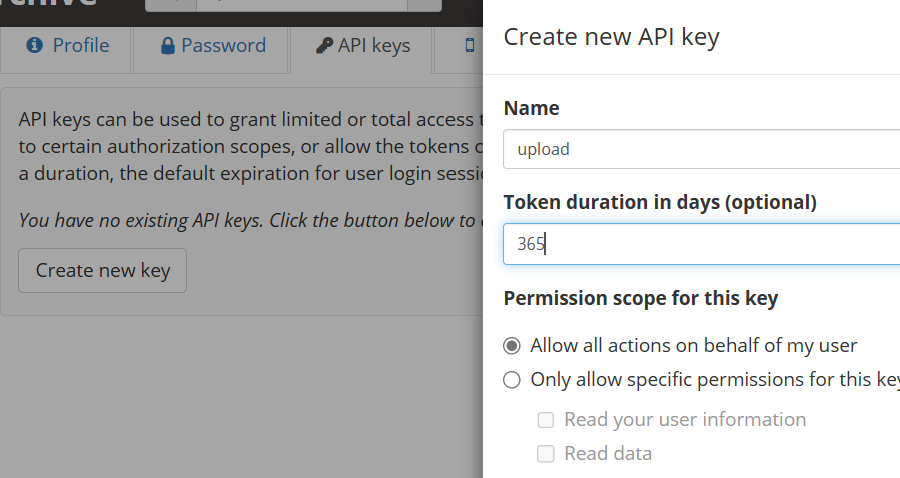
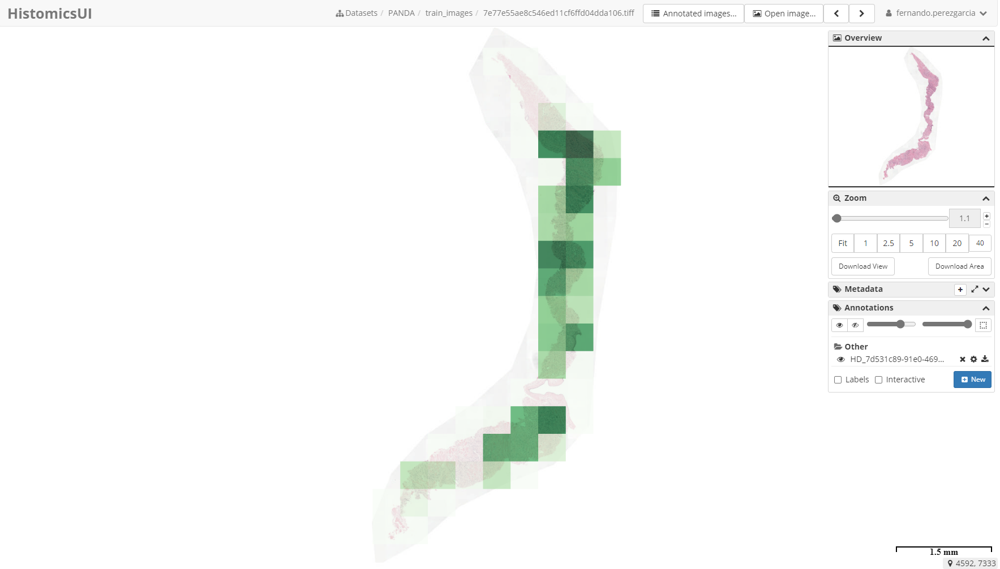

# Digital Slide Archive

The [Digital Slide Archive][1] (DSA) is "a containerized web-based platform for the analysis, visualization, management and
annotation of whole-slide digital pathology imaging data".
It is an open-source project based on [Kitware][11]'s data management platform [Girder][10].

## Azure deployment

We have deployed the DSA on [Azure][2] to visualize our data and interpret our models and experiments.
Below are instructions to replicate our deployment using your own data.

### Host

The first step is [creating a Linux virtual machine][4] (VM) to host the DSA.
The code can be [downloaded from GitHub][5] and run using [Docker][6].
By default, the application runs at port 8080.
To use HTTPS, an SSL certificate must be obtained and port 443 may be specified instead within the Docker configuration.
The DSA uses [Cherrypy][8] as the underlying server engine.
Therefore, Cherrypy must be [configured][9] to use the SSL certificate installed in the VM.
Ports in a VM can be opened using [network security group rules][7].

### Storage

The datasets we use are securely stored in [Azure Blob Storage][3] containers.
Containers can be mounted on the host machine using [BlobFuse][13].
Then, Girder [assetstores][12] can be created and fed data from the mounted containers.

### Authentication

We have [added][14] Microsoft as a provider in the [OAuth2 Login][15] plugin for Girder.
The authentication settings widget describes the steps needed to generate the provider credentials.

First, our deployed DSA must be [registered][16] in [Azure Active Directory][17] (Azure AD) as an application.

[][16]

Once the DSA app has been registered, a client ID (also called _application ID_) will be generated.
Then, a client secret (also called _application password_) must also be generated.
Finally, the _tenant ID_ (the Azure ID of your organization) _may_ be specified so that access is restricted to users belonging to your tenant.
These three strings will be used to configure authentication in the OAuth2 Login plugin settings.

### Authorization

User [permissions][18] can be set to different data collections in an assetstore, to maximize protection of sensitive data.

### Creating API Keys

You can create an API key for a user in DSA directly on the web.

- Navigate to your DSA and log in
- Click on "Users" in the navigation bar
- Click on the user you want to create an API key for
- On the top right, there is a menu "Actions", choose "Edit user"
- You will see 4 tabs with user information, click on "API Keys"
- Choose a name for the key, a duration in days. It is important to choose "Allow all actions on behalf of this user"!
- Click "Create". You will see the list of keys, press "show" to reveal the actual key value. Copy it.
- Set the key as an environment variable `DSA_API_KEY` (in `bash`, this would be `export DSA_API_KEY=<the key>`)
- In addition, you can also set the URL for your DSA instance as an environment variable `DSA_URL` (in `bash`, this would be
  `export DSA_URL=<the url>`)



## Visualizing Azure Machine Learning results

The [Girder RESTful API][19] may be used to upload annotations to DSA items programmatically.
An example of a use case is creating annotations to visualize attention maps generated by a deep learning model.
The `girder` module in this repository includes tools to download training results from Azure Machine Learning (Azure ML) and
upload annotations to a deployed DSA.
For example:

```shell
SCRIPT="hi-ml-cpath/src/histopathology/utils/girder.py"
python $SCRIPT \
    --run-id "Experiment_transformer_Gleason_run_0" \
    --dsa-url "https://my-deployed-dsa.azure.com/" \
    --dsa-key "AHKZ42Ks24kSH5Fxt3354ryKzCxamjqM" \
    --workspace-config "config.json" \
```

The DSA URL and API key may be specified in environment variables `DSA_URL` and `DSA_API_KEY` instead, see above.
The workspace configuration file contains information related to the [Azure Machine Learning workspace][22]:

```json
{
    "subscription_id": "22f7beb4-1b54-9ee7-5255-6dbcc8da000b",
    "resource_group": "myresourcegroup",
    "workspace_name": "myworkspace"
}
```

It can be downloaded from the workspace website:

[](https://docs.microsoft.com/en-us/azure/machine-learning/how-to-configure-environment#workspace)

The script uses the [Azure SDK][20] and the [Python client for the Girder API][21] to:

1. Log into Azure ML
1. Download training results
1. Generate JSON annotations for each slide
1. Search for the slide by slide ID in DSA by using full text search
1. Upload the annotations to the deployed DSA

For a full description of all the options, add `--help` to the arguments.

Below is an example of an attention map overlaid on a slide from the [PANDA][22] dataset:



### Upload into a folder

The `girder.py` script can also upload the annotations into a folder in DSA. This is helpful if there are multiple
variants of the same slide in DSA, but located in different folders. Simple text search would then return multiple
results.

To use the folder functionality, you need to supply the name of the folder via `--folder`. For example, to upload the
annotations to folder `foo` in collection `Collection`, add ``--folder Collection1/foo`.

When supplying a folder argument, searching for the slide where annotations will be added works differently:

1. Firstly, all slides in the folder are retrieved.
1. Then, the script tries to identify which of the slides in the folder contains the value from the `slide_id` field.
1. If there is exactly one matching slide, the annotations are added to that slide. Annotations that match zero or more than
   one slide are ignored.

[1]: https://digitalslidearchive.github.io/digital_slide_archive/
[2]: https://azure.microsoft.com/
[3]: https://azure.microsoft.com/services/storage/blobs/
[4]: https://docs.microsoft.com/azure/virtual-machines/linux/quick-create-portal
[5]: https://github.com/DigitalSlideArchive/digital_slide_archive/blob/master/devops/README.rst
[6]: https://www.docker.com/
[7]: https://docs.microsoft.com/en-us/azure/virtual-machines/windows/nsg-quickstart-portal
[8]: https://docs.cherrypy.dev/en/latest/
[9]: https://docs.cherrypy.dev/en/latest/deploy.html#ssl-support
[10]: https://girder.readthedocs.io/
[11]: https://www.kitware.com/
[12]: https://girder.readthedocs.io/en/latest/user-guide.html#assetstores
[13]: https://github.com/Azure/azure-storage-fuse
[14]: https://github.com/girder/girder/pull/3393
[15]: https://girder.readthedocs.io/en/latest/plugins.html#oauth2-login
[16]: https://docs.microsoft.com/en-us/azure/active-directory/develop/quickstart-register-app
[17]: https://azure.microsoft.com/en-us/services/active-directory/
[18]: https://girder.readthedocs.io/en/stable/user-guide.html#permissions
[19]: https://girder.readthedocs.io/en/latest/api-docs.html
[20]: https://docs.microsoft.com/en-us/azure/developer/python/sdk/azure-sdk-overview
[21]: https://girder.readthedocs.io/en/latest/python-client.html#python-client
[22]: https://docs.microsoft.com/en-us/azure/machine-learning/concept-workspace
