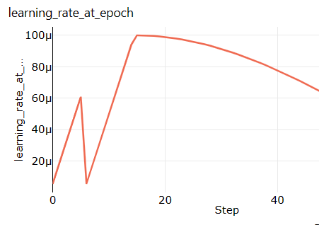

# Using Cheap Low Priority VMs

By using Low Priority machines in AzureML, we can run training at greatly reduced costs (around 20% of the original
price, see references below for details). This comes with the risk, though, of having the job interrupted and later
re-started. This document describes the inner workings of Low Priority compute, and how to best make use of it.

Because the jobs can get interrupted, low priority machines are not suitable for production workload where time is
critical. They do offer a lot of benefits though for long-running training jobs or large scale experimentation, that
would otherwise be expensive to carry out.

## Setting up the Compute Cluster

Jobs in Azure Machine Learning run in a "compute cluster". When creating a compute cluster, we can specify the size of
the VM, the type and number of GPUs, etc. Doing this via the AzureML UI is described
[here](https://docs.microsoft.com/en-us/azure/machine-learning/how-to-create-attach-compute-studio#amlcompute). Doing it
programmatically is described
[here](https://docs.microsoft.com/en-us/azure/machine-learning/how-to-create-attach-compute-cluster?tabs=python)

One of the setting to tweak when creating the compute cluster is whether the machines are "Dedicated" or "Low Priority":

* Dedicated machines will be permanently allocated to your compute cluster. The VMs in a dedicated cluster will be
  always available, unless the cluster is set up in a way that it removes idle machine. Jobs will not be interrupted.
* Low priority machines effectively make use of spare capacity in the data centers, you can think of them as
  "dedicated machines that are presently idle". They are available at a much lower price (around 20% of the price of a
  dedicated machine). These machines are made available to you until they are needed as dedicated machines somewhere
  else.

In order to get a compute cluster that operates at the lowest price point, choose

* Low priority machines
* Set "Minimum number of nodes" to 0, so that the cluster removes all idle machines if no jobs are running.

For details on pricing, check
[this Azure price calculator](https://azure.microsoft.com/en-us/pricing/details/virtual-machine-scale-sets/linux/),
choose "Category: GPU". The price for low priority VMs is given in the "Spot" column

## Behaviour of Low Priority VMs

Jobs can be interrupted at any point, this is called "low priority preemption". When interrupted, the job stops - there
is no signal that we can make use of to do cleanup or something. All the files that the job has produced up to that
point in the `outputs` and `logs` folders will be saved to the cloud.

At some later point, the job will be assigned a virtual machine again. When re-started, all the files that the job had
produced in its previous run will be available on disk again where they were before interruption, mounted at the same
path. That is, if the interrupted job wrote a file `outputs/foo.txt`, this file will be accessible as `outputs/foo.txt`
also after the restart.

Note that all AzureML-internal log files that the job produced in a previous run will be **overwritten**
(this behaviour may change in the future). That is in contrast to the behaviour for metrics that the interrupted job had
saved to AzureML already (for example, metrics written by a call like `Run.log("loss", loss_tensor.item())`):
Those metrics are already stored in AzureML, and will still be there when the job restarts. The re-started job will
then **append** to the metrics that had been written in the previous run. This typically shows as sudden jumps in
metrics, as illustrated here:

In this example, the learning rate was increasing for the first 6 or so epochs. Then the job got preempted, and started
training from scratch, with the initial learning rate and schedule. Note that this behaviour is only an artifact of how
the metrics are stored in AzureML, the actual training is doing the right thing.

How do you verify that your job got interrupted? Usually, you would see a warning displayed on the job page in the
AzureML UI, that says something along the lines of "Low priority compute preemption warning: a node has been preempted."
. You can use kinks in metrics as another indicator that your job got preempted: Sudden jumps in metrics after which the
metric follows a shape similar to the one at job start usually indicates low priority preemption.

Note that a job can be interrupted more than one time.

## Best Practice Guide for Your Jobs

In order to make best use of low priority compute, your code needs to be made resilient to restarts. Essentially, this
means that it should write regular checkpoints, and try to use those checkpoint files if they already exist. Examples of
how to best do that are given below.

In addition, you need to bear in mind that the job can be interrupted at any moment, for example when it is busy
uploading huge checkpoint files to Azure. When trying to upload again after restart, there can be resource collisions.

### Writing and Using Recovery Checkpoints

When using PyTorch Lightning, you can add a checkpoint callback to your trainer, that ensures that you save the model
and optimizer to disk in regular intervals. This callback needs to be added to your `Trainer` object. Note that these
recovery checkpoints need to be written to the `outputs` folder, because only files in this folder get saved to Azure
automatically when the job gets interrupted.

When starting training, your code needs to check if there is already a recovery checkpoint present on disk. If so,
training should resume from that point.

Here is a code snippet that illustrates all that:

```python
import re
from pathlib import Path
import numpy as np
from health_ml.utils import AzureMLLogger
from pytorch_lightning import Trainer
from pytorch_lightning.callbacks import ModelCheckpoint

RECOVERY_CHECKPOINT_FILE_NAME = "recovery_"
CHECKPOINT_FOLDER = "outputs/checkpoints"


def get_latest_recovery_checkpoint():
    all_recovery_files = [f for f in Path(CHECKPOINT_FOLDER).glob(RECOVERY_CHECKPOINT_FILE_NAME + "*")]
    if len(all_recovery_files) == 0:
        return None
    # Get recovery checkpoint with highest epoch number
    recovery_epochs = [int(re.findall(r"[\d]+", f.stem)[0]) for f in all_recovery_files]
    idx_max_epoch = int(np.argmax(recovery_epochs))
    return str(all_recovery_files[idx_max_epoch])


recovery_checkpoint = ModelCheckpoint(dirpath=CHECKPOINT_FOLDER,
                                      filename=RECOVERY_CHECKPOINT_FILE_NAME + "{epoch}",
                                      period=10)
trainer = Trainer(default_root_dir="outputs",
                  callbacks=[recovery_checkpoint],
                  logger=[AzureMLLogger()],
                  resume_from_checkpoint=get_latest_recovery_checkpoint())
```

## Additional Optimizers and Other State

In order to be resilient to interruption, your jobs need to save all their state to disk. In PyTorch Lightning training,
this would include all optimizers that you are using. The "normal" optimizer for model training is saved to the
checkpoint by Lightning already. However, you may be using callbacks or other components that maintain state. As an
example, training a linear head for self-supervised learning can be done in a callback, and that callback can have its
own optimizer. Such callbacks need to correctly implement the `on_save_checkpoint` method to save their state to the
checkpoint, and `on_load_checkpoint` to load it back in.

For more information about persisting state, check
the [PyTorch Lightning documentation](https://pytorch-lightning.readthedocs.io/en/latest/extensions/callbacks.html?highlight=callback#persisting-state)
.
