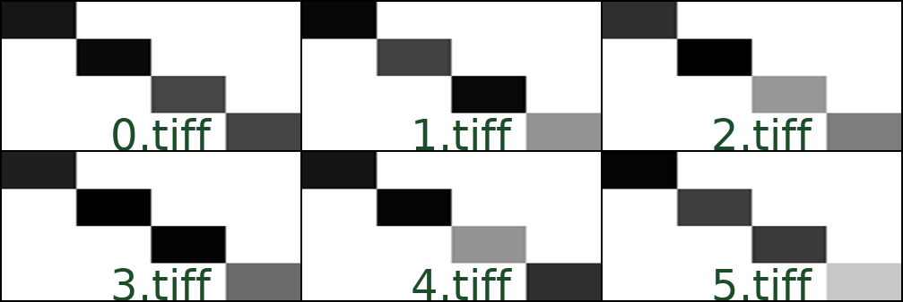
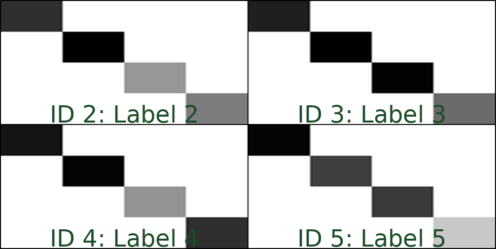

# Creating montages from whole slide images (WSIs)

For working with large amounts of histology data, it is often useful to create montages of the data.
Montages are a collection of images that are stitched together to form a single image.
Montages are useful for visualizing large amounts of data at once, and can be used to create a single image that can be used for analysis.
The `hi-ml-cpath` toolbox contains scripts that help with the creation of montages from whole slide images (WSIs).

Creating montages can be very time-consuming. It can hence be helpful to run the process in the cloud. The montage
creation code provided here can be run in AzureML very easily.

## Types of data for montage creation

1. Montages can be created from a folder of images, by specifying the name of the folder and a glob pattern, like
   `**/foo_*.tiff`.
1. Montages can be created by first reading a file called `dataset.csv` located in a folder. `dataset.csv` is
   effectively a Pandas DataFrame, with each row corresponding to a single image.
   More details on the format of `dataset.csv` can be found below.

Montage creation works for all WSI image formats that are supported by either of the two possible backends:

- [`openslide`](https://openslide.org/api/python/) supports `.tif(f)`, `.ndpi`, `.scn` and others
- [`cucim`](https://pypi.org/project/cucim/) supports `.svs`, `.tiff` and others

## Setup

- Check out the `hi-ml` repository via `git clone https://github.com/microsoft/hi-ml`
- Run the following commands:

```shell
cd hi-ml-cpath
make env
conda activate HimlHisto
make pip_local
```

All the commands listed below assume that

- you have activated the Conda environment `HimlHisto`
- your current working directory is `<repo root>/hi-ml-cpath`

## Creating montages from a folder with files

The following command will create a montage from all files in the folder `/data` that match the pattern
`**/*.tiff`.

```shell
python src/health_cpath/scripts/create_montage.py --dataset /data --image_glob_pattern '**/*.tiff' --level 2 --width 1000 --output_path montage1
```

This will create a montage from all TIFF files in folder `/data`. Each TIFF file is read as a multi-level image, and
level 2 is read for creating the montage.

The `--width` argument determines the width in pixel of the output image. The height of the output image is determined
automatically. Note that the width given here, 1000, is suitable only for montages from a very small number of files
(say, 10). See below for more details on this commandline option.

This will create two images in the folder specified by the `--output_path montage1` argument, hence outputting the files `montage1/montage.jpg` and `montage1/montage.png`.

Here's an example how this could look like for a folder with 6 images, `0.tiff` through `5.tiff`:



## Creating montages from a `dataset.csv` file

If the montage creation script is only pointed to a folder, without providing a glob pattern,
it assumes that a file `dataset.csv` is present. A montage will be created from only the images
listed in `dataset.csv`. In addition, an optional `label` column will be added to the text that is
overlayed onto the images itself.

The dataset file should be a CSV file, with each row corresponding to a single image.
When working with a `dataset.csv` file, the following columns are handled:

| Column name | Contents                                                                                       | Required? |
| ----------- | ---------------------------------------------------------------------------------------------- | --------- |
| `image`     | The path of the image that should be loaded                                                    | Required  |
| `slide_id`  | A unique identifier for the slide                                                              | Required  |
| `label`     | An additional string that will be placed on the montage, This could be `0`, `1`, `tumour`, ... | Optional  |
| `mask`      | The path of an additional image that will rendered next to the image given in `image`          | Optional  |

Consider this example dataset file:

```text
image,slide_id,label
2.tiff,ID 2,Label 2
3.tiff,ID 3,Label 3
4.tiff,ID 4,Label 4
5.tiff,ID 5,Label 5
```

Run montage creation with the following command:

```shell
python src/health_cpath/scripts/create_montage.py --dataset /data --level 2 --width 1000 --output_path montage1
```

This would produce (assuming that the images `2.tiff`, `3.tiff`, `4.tiff`, and `5.tiff` are present in the folder
`/data`) a montage similar to this one:



### Using inclusion or exclusion lists

When creating montages from a `dataset.csv` file, it is possible to create montages from only a specific subset
of rows, or all rows apart from those in a given list.

- Use the `--exclude_by_slide_id exclude.txt` argument to point to a file with a list of slide IDs that should be
   excluded from the montage.
- Use the `--include_by_slide_id include.txt` argument to point to a file with a list of slide IDs for which
   the montage should be created.

The files `exclude.txt` and `include.txt` should contain one slide ID per line.

## Other commandline options

- Use `--width=20000` to set the width of the output montage image. The height of the output image is determined
  automatically. Mind that the default value is 60_000, suitable for several hundreds of input images. If you want to try
  out montage creation on a small set of files (say, 10), ensure that you set the width to a reasonably small value,
  like `--width=1000`
- Use `--parallel=2` to specify the number of parallel processes that should be used for creating image thumbnails.
  Thumbnails are created in a first step, using multiple processes, and then the thumbnails are stitched into the final
  montage in the main process.
- Use `--backend=cucim` to switch the image reader backend to `CuCIM`. The default backend is `openslide`.

## Running in Azure

The `create_montage.py` script can be run in AzureML by adding 3 commandline arguments.

To set up Azure and AzureML:

- Follow the steps in the [AzureML onboarding](azure_setup.md).
- At the end of the onboarding you will download a file `config.json` from your AzureML workspace to your repository
  root folder.
- To understand datasets, please read through the [AzureML datasets](datasets.md) documentation. Then create an AzureML
  datastore that points to your Azure Blob Storage account.
- Upload your WSIs to a folder in Azure Blob Storage. This can be done most efficiently via
  [azcopy](http://aka.ms/azcopy). `azcopy` can also copy directly across cloud providers, for example from AWS to Azure.

The following command will upload all files in the folder `my_test_slides` to a container `datasets` in your Azure Blob
Storage account called `mystorage`, creating a folder `my_test_slides` in the storage account in the process:

```shell
azcopy copy my_test_slides https://mystorage.blob.core.windows.net/datasets/ --recursive
```

The following command will then create a run in AzureML that executes montage creation from that folder:

```shell
python src/health_cpath/scripts/create_montage.py --dataset my_test_slides --level 2 --width 1000 --cluster <clustername> --conda_env environment.yml --datastore <datastorename>
```

In this command, replace the following:

- Replace `my_test_slides` with the name of the folder in blob storage where you uploaded your WSIs.
- `clustername` is the name of a [compute
cluster](https://learn.microsoft.com/en-us/azure/machine-learning/quickstart-create-resources#create-compute-clusters)
where your job will execute)
- `datastorename` is the name of an AzureML datastore, essential a pointer to your blob storage account plus the
  credentials that are necessary to access it. For the above example, the data store needs to point to storage account
  `mystorage` and container `datasets`.

The command above will only run for a minute or less - it will mostly create a snapshot of the code and send that off to
the cloud for execution. At the end you will see a link printed out that takes you to the AzureML portal, where you can
monitor the progress of the run.

Once the run is completed, you will find two files `montage.jpg` and `montage.png` in the tab "Outputs" of the run, and
an option to download it to your machine.
