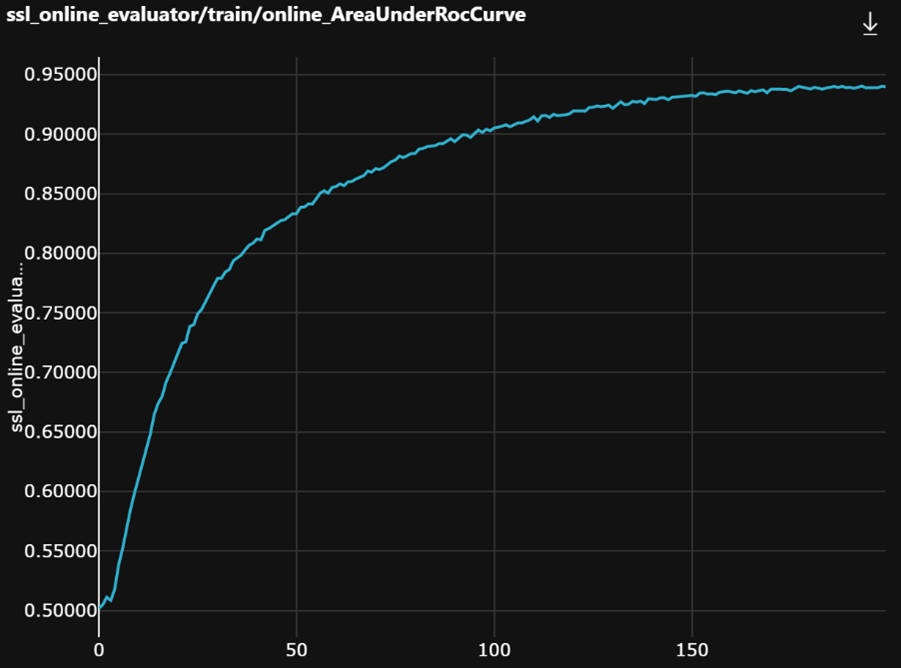
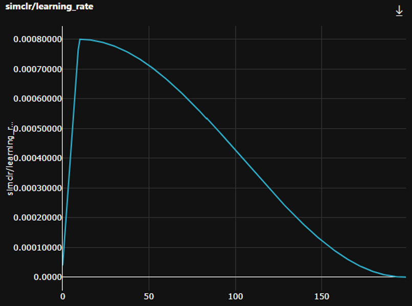
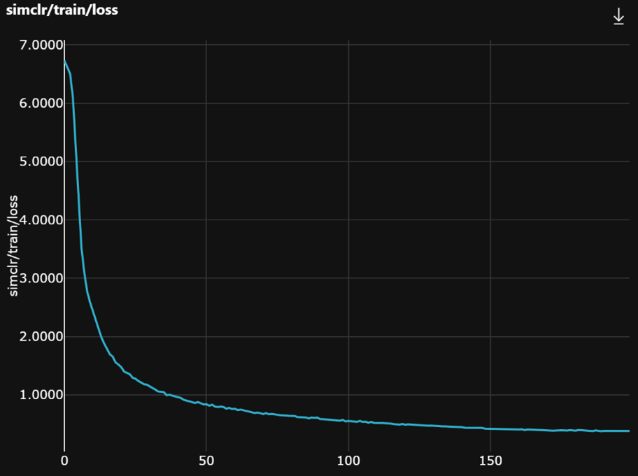
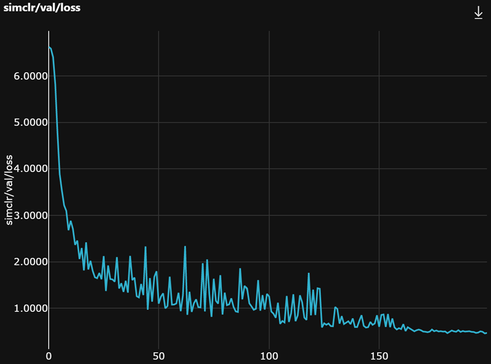

# Pre-training of an image encoder using self-supervised learning

Often in histopathology, we only have access to weak labels, e.g., a single label for an entire Whole Slide Image (WSI).
However, papers like [DeepSmiles](https://arxiv.org/abs/2107.09405) show that we can use unlabeled tiles from WSI to
pre-train an image encoder using Self-Supervised Learning (SSL). In hi-ml, we have implemented two popular
self-supervised learning methods [SimCLR](https://arxiv.org/abs/2002.05709) and
[BYOL](https://arxiv.org/abs/2006.07733). We will use the TCGA-CRCk dataset, as seen in [Kather et al.
2019](https://www.ncbi.nlm.nih.gov/pmc/articles/PMC7423299/), the dataset comes with binary WSI labels (microsatellite
stable or instable). We will use the TCGA-CRCk dataset as an example to show how to set up SSL training in hi-ml. If you
want to use your own dataset, you will find instructions at the end of this section.

## Example: Train an image encoder using SSL on the TCGA-CRCk locally

The TCGA-CRCk dataset consists of colorectal tumor tiles extracted from Formalin-Fixed, Paraffin-Embedded (FFPE) WSIs
from the Cancer Genome Atlas (TCGA) with accompanying binarized MicroSatellite Instability (MSI) labels. In the case of
TCGA-CRCk, the dataset is already tiled, i.e., the WSI are not available. In [public_datasets.md](./public_datasets.md)
you will find instructions on how to download and setup the TCGA-CRCk dataset.

To train an image encoder using SSL locally run this in the `hi-ml-cpath` folder, with the `HimlHisto` conda
enviroment activated:

```bash
python ../hi-ml/src/health_ml/runner.py --model SSL.CRCK_SimCLR
```

The model class
[```CRCK_SimCLR```](https://github.com/microsoft/hi-ml/blob/7f4baadaa8bc0d08a4895ca896ebc3f68ea6a4f8/hi-ml-histopathology/src/histopathology/configs/SSL/CRCK_SimCLRContainer.py#L24)
is the config used to train a SSL model on TCGA-CRCk. It houses everything, e.g., the model, the dataset, checkpointing,
etc. Here, we need to define some important parameters:

1. The type of image encoder we want to train, the type of SSL (SimCLR or BYOL) we want to use, and the batch_size.

+ [```ssl_encoder=EncoderName.resnet50```](https://github.com/microsoft/hi-ml/blob/7f4baadaa8bc0d08a4895ca896ebc3f68ea6a4f8/hi-ml-histopathology/src/histopathology/configs/SSL/CRCK_SimCLRContainer.py#L52)

+ [```ssl_training_type=SSLTrainingType.SimCLR```](https://github.com/microsoft/hi-ml/blob/7f4baadaa8bc0d08a4895ca896ebc3f68ea6a4f8/hi-ml-histopathology/src/histopathology/configs/SSL/CRCK_SimCLRContainer.py#L53)

+ [```ssl_training_batch_size=48```](https://github.com/microsoft/hi-ml/blob/7f4baadaa8bc0d08a4895ca896ebc3f68ea6a4f8/hi-ml-histopathology/src/histopathology/configs/SSL/CRCK_SimCLRContainer.py#L51)

1. The dataset we want to use for training the image encoder and the linear model we only use for evaluation of the
   image encoder. In theory, they could be two different datasets.

+ [```ssl_training_dataset_name=SSL_Dataset_TCGA_CRCK```](https://github.com/microsoft/hi-ml/blob/7f4baadaa8bc0d08a4895ca896ebc3f68ea6a4f8/hi-ml-histopathology/src/histopathology/configs/SSL/CRCK_SimCLRContainer.py#L40)

+ [```linear_head_dataset_name=SSL_Dataset_TCGA_CRCK```](https://github.com/microsoft/hi-ml/blob/7f4baadaa8bc0d08a4895ca896ebc3f68ea6a4f8/hi-ml-histopathology/src/histopathology/configs/SSL/CRCK_SimCLRContainer.py#L41)

1. Model checkpointing: We use [PyTorch lightning
   checkpointing](https://pytorch-lightning.readthedocs.io/en/stable/common/checkpointing.html). Among others, we define
   the validation metric, where the ```online_evaluator``` is the same as the ```linear_head```. In the case of
   TCGA_CRCK, we use AUC ROC as the validation metric.

+ [```model_monitor_metric='ssl_online_evaluator/val/AreaUnderRocCurve'```](https://github.com/microsoft/hi-ml/blob/7f4baadaa8bc0d08a4895ca896ebc3f68ea6a4f8/hi-ml-histopathology/src/histopathology/configs/SSL/CRCK_SimCLRContainer.py#L48)

In the parent class of ```CRCK_SimCLR```, ```HistoSSLContainer``` the data augmentations are defined. Data augmentation
is one of the most important components of SSL training. Currently, we have hardcoded the data augmentation used in the
[SimCLR paper](https://arxiv.org/abs/2002.05709). These are the following:

+ [```RandomResizedCrop(size=224)```](https://github.com/microsoft/hi-ml/blob/341afee5869d0d8d5db99283c06959d73517d8b7/hi-ml-histopathology/src/histopathology/configs/SSL/HistoSimCLRContainer.py#L57)

+ [```RandomHorizontalFlip(p=0.5)```](https://github.com/microsoft/hi-ml/blob/341afee5869d0d8d5db99283c06959d73517d8b7/hi-ml-histopathology/src/histopathology/configs/SSL/HistoSimCLRContainer.py#L58)

+ [```RandomApply([ColorJitter(brightness=0.8, contrast=0.8, saturation=0.8, hue=0.2)], 0.8)```](https://github.com/microsoft/hi-ml/blob/341afee5869d0d8d5db99283c06959d73517d8b7/hi-ml-histopathology/src/histopathology/configs/SSL/HistoSimCLRContainer.py#L59)

+ [```RandomGrayscale(p=0.2)```](https://github.com/microsoft/hi-ml/blob/341afee5869d0d8d5db99283c06959d73517d8b7/hi-ml-histopathology/src/histopathology/configs/SSL/HistoSimCLRContainer.py#L60)

+ [```GaussianBlur(int(224 * 0.1) + 1)```](https://github.com/microsoft/hi-ml/blob/341afee5869d0d8d5db99283c06959d73517d8b7/hi-ml-histopathology/src/histopathology/configs/SSL/HistoSimCLRContainer.py#L61)

While not optimized for WSI we observe good performance using these augmentations. The data augmentations are wrapped by
[```DualViewTransformWrapper```](https://github.com/microsoft/hi-ml/blob/ff24cc34c85b1f4f1692419cbbb3a9818127c9c6/hi-ml-histopathology/src/SSL/data/transforms_utils.py#L74)
to return two augmented versions per tile, as required by the majority of SSL methods.

## Train on Azure

In the case of SimCLR, the effective batch_size (batch_size * GPU) should be as big as possible. The SSL models in hi-ml
natively supports distributed training using multiple GPUs. We recommend using 8 GPUs for running the SimCLR model on
the TCGA-CRCk dataset. Assuming you are using a total of 8  GPUs (e.g. 1 node with 8 GPUs or 2 nodes with 4 GPUs) in
Azure you can start training with the following command in the repository root folder:

```bash
python hi-ml/src/health_ml/runner.py --model SSL.CRCK_SimCLR --cluster CLUSTER_NAME --conda_env hi-ml-cpath/environment.yml
```

A SimCLR run with 200 epochs, 8 GPUs, and a batch size of 48 (per GPU) takes about 6 hours. On Azure we use
Standard_ND40rs_v2 (40 cores, 672 GB RAM, 2900 GB disk, 8 x NVIDIA Tesla V100).

Let's have a look at the training behavior.

As mentioned previously, using the WSI label for each tile of the same slide and a linear head on the outputs of the
image encoder to monitor training works quite well. We see a smooth and steady increase of the validation metric.



In addition, we are using a cosine learning rate schedule with a fixed warm up of 10 epochs. Note: The SSL code in hi-ml
automatically scales the learning rate to the number of GPUs used during training, as described
[here](https://arxiv.org/abs/1706.02677).



Last, the training and validation loss curves are expected to look like this.




After training, we can use the pre-trained image encoder on downstream tasks like microsatellite stable/instable
prediction on TCGA-CRCk. You only have to specify the path to the checkpoint of the SSL image encoder in the setup
function of
[```DeepSMILECrck```](https://github.com/microsoft/hi-ml/blob/341afee5869d0d8d5db99283c06959d73517d8b7/hi-ml-histopathology/src/histopathology/configs/classification/DeepSMILECrck.py#L60).

## Using your own dataset

For scripts that help you tile your own dataset please see
[```histopathology/preprocessing/tiling.py```](https://github.com/microsoft/hi-ml/blob/main/hi-ml-histopathology/src/histopathology/preprocessing/tiling.py).
In the case of TCGA-CRCk, the dataset is already tiled.
[```TcgaCrck_TilesDataset```](https://github.com/microsoft/hi-ml/blob/main/hi-ml-histopathology/src/histopathology/datasets/tcga_crck_tiles_dataset.py)
is a child of
[```TilesDataset```](https://github.com/microsoft/hi-ml/blob/main/hi-ml-histopathology/src/histopathology/datasets/base_dataset.py).
For a
[```TilesDataset```](https://github.com/microsoft/hi-ml/blob/main/hi-ml-histopathology/src/histopathology/datasets/base_dataset.py)
we assume that each tile has a unique tile index and a label. Since we assume that we are working with weakly labelled
WSI we do not have access to the real tile labels. However, we found that monitoring the SSL training using the slide
label for each tile works sufficiently well. I.e., if the WSI has a positive label then every tile from the WSI has a
positive label. Last, the unique index for each tile is used to make sure we don't use twice the same tile in one
training epoch during SSL training.

Subsequently, the TCGA-CRCk dataset is wrapped in
[```TcgaCrck_TilesDatasetReturnImageLabel```](https://github.com/microsoft/hi-ml/blob/main/hi-ml-histopathology/src/histopathology/datasets/tcga_crck_tiles_dataset.py).
Here the data augmentations are applied and the ```__getitem__``` method is defined.

The dataset is then wrapped one last time in
[```TcgaCrck_TilesDatasetWithReturnIndex```](https://github.com/microsoft/hi-ml/blob/main/hi-ml-histopathology/src/histopathology/datasets/tcga_crck_tiles_dataset.py),
where we inherit the ability to return the tile index from
[```DatasetWithReturnIndex```](https://github.com/microsoft/hi-ml/blob/main/hi-ml-histopathology/src/SSL/data/dataset_cls_utils.py).
